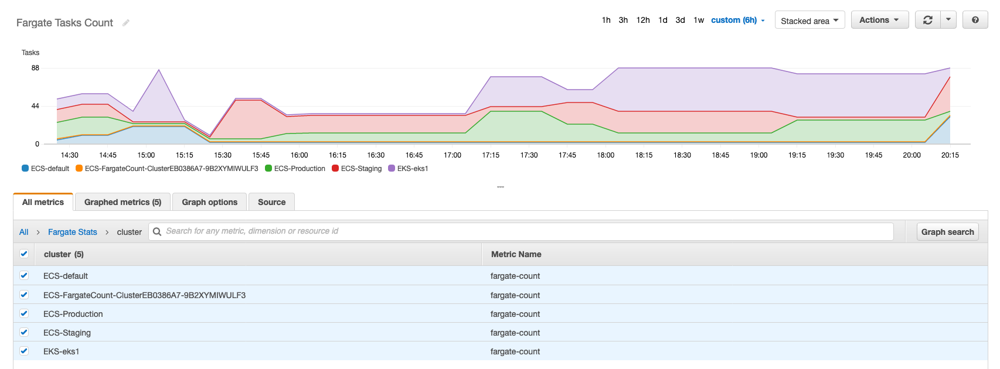
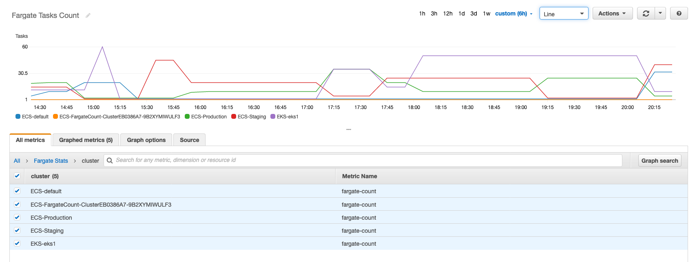
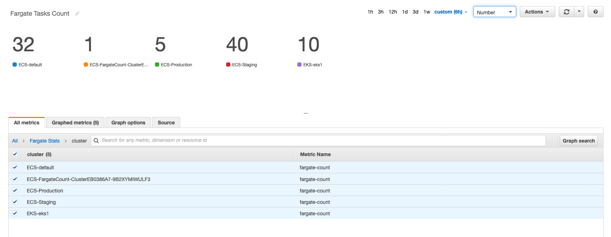

## What is Fargatecount?

`Fargatecount` allows AWS customers to track, with a custom CloudWatch metric, the total number of ECS tasks and EKS pods they have deployed on Fargate in a specific region of a specific account.


## What problem does Fargatecount solve?

Today Fargate customers do not have an easy way to understand how many tasks and pods are running (or have been running over time) on Fargate across both EKS and ECS clusters in a specific region of a specific account. This has a practical implication in that there is a limit of Fargate tasks that you can run in a given region per account and the customer can't track that number easily. `Fargatecount` solves this problem. It gives customers an easy way to plot the usage over time as well as a way to set alarms based on usage (e.g. if my current limit is 100 tasks and pods running on Fargate per region / per account, I want CloudWatch to send me an alarm when I have a total of 80 tasks and pods deployed across ALL of the clusters I have).   

## How does Fargatecount look like?

`Fargatecount` surfaces as a new custom metric (`fargate-count`) of a custom namespace (`Fargate Stats`) in Cloud Watch. This means that you can track Fargate usage (for tasks and pods deployed across both ECS and EKS APIs). You can do so by adding graphs to a CloudWatch Dashboard or by creating alarms based on either total Fargate consumption across all clusters or at the single cluster level. 

These are examples of standard CloudWatch views for this metric. This is, for example, an environment with 4 ECS clusters and 1 EKS cluster all deploying a variable amount of tasks and pods on Fargate over time.

This is the `stacked` view that shows the total amount of tasks and pods at any point in time:


This is the `line` view that shows the individual (at the cluster level) amount of tasks and pods at any point in time:



This is the `number` view that shows the individual (at the cluster level) amount of tasks and pods at a particular point in time:


Note: the 4th ECS cluster is `Fargatecount`'s own cluster.  

## What does Fargatecount install ?

`Fargatecount` creates a VPC (optionally) and an ECS cluster (without EC2 instances) where it schedules a Fargate task to run every 10 minutes to gather the statistics and push them to CloudWatch (optionally). The Fargate task runs a script that that. Note that the tool by default does not put metrics into CloudWatch. It only prints these information on standard out whenever it runs (every 10 minutes). If you want to arm the script to put to CloudWatch you need to set the `armed=true` system variable. More on this in the `Getting Started` section. 

## Getting started

Fargatecount is packaged as a CDK application and the end result is visible to the user as a single CloudFormation stack (created by CDK). Depending on your level of comfort with CDK you can pick your sections here below.  

#### I know CDK inside out  

If you are familiar with how CDK works and/or you have a CDK environment up and running you can skip the next section.  

#### What is CDK? How do you spell it? 

If you are new to CDK and/or you don't have a CDK environment handy, you can use [eksutils](https://github.com/mreferre/eksutils) if you want a ready-to-use multi-purpose shell for using with everything containers at AWS:

```
docker run -it --rm -v /var/run/docker.sock:/var/run/docker.sock mreferre/eksutils:latest
sh-4.2# export AWS_ACCESS_KEY_ID=xxxxxxxxxxxxxxxx
sh-4.2# export AWS_SECRET_ACCESS_KEY=xxxxxxxxxxxxxxxxxxx    
sh-4.2# export AWS_DEFAULT_REGION=<region>
```
If this is the first time you are using the CDK you may also need to [bootstrap](https://cdkworkshop.com/20-typescript/20-create-project/500-deploy.html#bootstrapping-an-environment) an environment.  

#### Download and install Fargatecount

At this point, wether you are a CDK expert user using your own environment or a CDK novice using `eksutils` per the above, you can continue with the actual setup:

```
git clone https://github.com/mreferre/fargatecount.git
cd fargatecount/cdk
npm install 
cdk -c armed=true deploy 
```

#### Enabling tracking of ECS clusters

There is nothing to be done to enable tracking of ECS clusters. With ECS, both authentication and RBAC is fully integrated with IAM. The CDK creates a dedicated IAM role that gets associated to the scheduled task that runs the script. This role is associated to a policy that can enumarate and describe ALL ECS clusters. The description of the ECS cluster also contains the number of active tasks running on Fargate (which is what `Fargatecount` tracks). Nothing to see here, move along folks.     

#### Enabling tracking of EKS clusters

Here there is a bit more work to do. With EKS, only authentication is fully integrated with IAM. This means that, while you can authenticate against every EKS cluster with the IAM role created by CDK and associated to the scheduled task, you explicitly need to tell every EKS cluster that this IAM role can query the cluster and get all pods across all namespaces (to be able to determine how many are running on Fargate). If you fail to do so, this role will be able to enumarate all EKS clusters because that is an AWS API fully integrated with IAM and not a Kubernetes API for which RBAC is managed at the cluster level. However you will see in the scheduled task log errors on the line of `error: You must be logged in to the server (Unauthorized)` because the `kubectl get pods` command in the script will fail. In order to be able to get the stats from an EKS cluster you need to add the IAM role to the Kubernetes cluster and configure the RBAC to allow the IAM role to do what it needs to do (nee: read all pods running across all namespaces). This procedure is outlined on the [AWS documentation](https://docs.aws.amazon.com/eks/latest/userguide/add-user-role.html). This [article](https://medium.com/swlh/kubernetes-access-control-with-iam-and-rbac-e9c051ee226b) is another great source to understand the mechanics of this. 

I will sunnurize below the steps you need to execute (for every EKS cluster) with a Kubernetes user that has enough privileges.

First and foremost, you need to identify the IAM role that has been created by CDK. You can do so but either noting the output of the `cdk deploy` command or by going into the Outputs tab of the CFN stack that the CDK deployment created. At this point you have to run this command:

```
kubectl edit -n kube-system configmap/aws-auth 
```

When the editor opens, you need to add this section to the `aws-auth` configmap:
```
    - rolearn: arn:aws:iam::<11111222233333>:role/<FargateCount-Role1XXXXX-XXXXXXXXXXXXX>
      username: fargatecountiamrole
      groups:
      - fargatecountk8srbacrole
```

We have just told this Kubernetes cluster that our IAM role (`FargateCount-Role1XXXXX-XXXXXXXXXXXXX`) maps to the Kubernetes user `fargatecountiamrole` which in turns belong to the Kubernetes group `fargatecountk8srbacrole`. 

Now we need to tell Kubernetes what that group can do on the cluster and then we need to bind the user to the group. You do so by running these two commands:

```
kubectl create clusterrole fargatecountk8srbacrole --verb=get,list,watch --resource=pods
kubectl create clusterrolebinding fargatecount-roles-binding --clusterrole=fargatecountk8srbacrole --user=fargatecountiamrole 
``` 

Rinse and repeat for every EKS cluster you have of which you want to track the internals and avoid the `error: You must be logged in to the server (Unauthorized)` message. 

#### Clean up 

Cleaning up the environment is as easy as running `cdk destroy` from where you left your prompt. 

## Known issues and limitations

* When an EKS cluster is enumerated and the RBAC configuration isn't set properly, the tool puts the value 0 to CloudWatch even if there are pods running on Fargate. Essentially a false negative. If you are using `Fargatecount` in a meaningful way you should keep an eye on the container logging to monitor for occurrencies of the error message as we way to track misconfigured clusters. 

* The tool is designed to support deploying to a different region from the CDK CLI leveraging the `-c region=<region>` variable at the `cdk deploy` command. Similarly, it supports deploying the scheduled task in the default VPC (without creating a new one) by setting the `-c use_default_vpc=true`. Neither of these variables have been tested thoroughly (a professional way to say they have not been tested). 

* Based on how the script works, you need to schedule a `Fargatecount` task for every combination of AWS account + region 

* If the Fargate task limit has already been reached, this scheduled task won't run, won't log and won't put any CloudWatch metric 

* This tool has not been tested at scale. One consideration that has been made while gathering feedback about it is that there could be a script per cluster putting data in CloudWatch "inside out" instead of a single script doing all the work "outside in" across all clusters. There are pros and cons with different approaches 

* It would be handy to parametrize via additional variables the scheduling timing (10 minutes), the name of the custom CloudWatch namespace (`Fargate Stats`) and the custom CloudWatch metric name (`fargate-count`). These can still be changed either in the `fargatecount.sh` script or in the CDK code before the deployment if these values don't work for you.  

* Surely the mechanism to enable tracking of EKS clusters could use some simplification 

## Credits 

We are all dwarfs that stand on the shoulders of giants and for me, this time, is was [Pauhud](https://github.com/pahud/) and his work [here](https://github.com/pahud/fargate-samples/tree/master/scheduled-fargate-tasks. I have just brutally copied, pasted and adapted to my needs.

